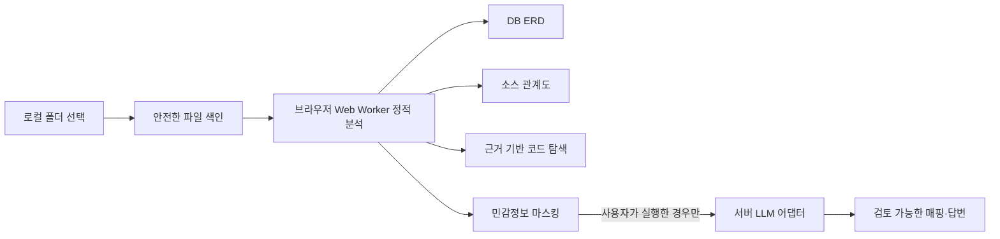

# Schema Lens

[](LICENSE)
[](package.json)

DB 접속이나 기존 ERD 없이도 로컬 소스와 SQL의 실제 근거를 따라 데이터 구조, 코드 흐름, 원문 위치를 함께 탐색하는 웹 도구입니다.

Source-grounded DB ERD, code relationship graph, and read-only source explorer — all starting from a local project folder.


## 무엇을 해결하나요?

운영 중인 시스템에는 최신 ERD가 없거나, DB 권한 없이 소스만 전달되는 경우가 많습니다. Schema Lens는 브라우저에서 폴더를 선택해 쿼리와 소스 코드를 정적 분석하고 다음 결과를 하나의 작업 공간에 연결합니다.

| 보기 | 확인할 수 있는 내용 |
| --- | --- |
| DB ERD | 테이블, 컬럼, PK/FK, JOIN으로 추론한 관계와 신뢰도 |
| 소스 관계도 | 파일 import, 테이블 READ/WRITE, 라우트, 함수와 계층 간 연결 |
| 소스 코드 | 계층형 파일 트리, 여러 파일 탭, 파일 내 검색, 줄 단위 근거 강조 |
| 근거·영향 | 관계를 만든 상대 파일 경로와 줄 범위, 최대 2단계 변경 영향 |
| 매핑 검토 | 정적 분석이 놓친 별칭과 교차 계층 관계에 대한 선택적 LLM 제안 |
| 자연어 질문 | 현재 그래프와 인용 가능한 근거 안에서만 생성한 답변 및 로컬 폴백 |

모델 제안은 그래프에 자동 확정되지 않습니다. 모든 제안은 별도 검토 화면에서 근거와 함께 확인한 뒤 채택하거나 제외할 수 있습니다.

## 동작 방식



폴더 색인, 원문 읽기, 1차 정적 분석은 브라우저 메모리와 전용 Worker 안에서 수행됩니다. 코드 탭은 선택한 텍스트 파일만 지연 로딩하며 원본 파일을 수정하지 않습니다.

## 빠른 시작

### 요구 환경

- Node.js 22.13 이상
- Corepack과 pnpm
- 폴더 선택 입력을 지원하는 최신 데스크톱 브라우저

### 설치와 실행

```bash
git clone https://github.com/efficjump/schema-lens.git
cd schema-lens
corepack enable
pnpm install --frozen-lockfile
pnpm dev
```

터미널에 표시된 로컬 URL을 엽니다. 별도 DB와 LLM 설정 없이도 내장 샘플, 정적 분석, 그래프 탐색, 코드 뷰어, 로컬 관계 기반 질문을 사용할 수 있습니다.

프로덕션 모드로 확인하려면 다음 명령을 사용합니다.

```bash
pnpm build
pnpm start
```

## 사용 방법

1. **내장 샘플 살펴보기**

   처음 실행하면 테이블, 쿼리, 라우트, 저장소 계층이 포함된 데모 프로젝트가 표시됩니다.

2. **실제 프로젝트 열기**

   우측 상단의 `폴더 열기`를 누르고 분석할 프로젝트 루트를 선택합니다. 폴더명만 화면에 표시되며 브라우저가 제공하지 않는 절대 로컬 경로는 수집하지 않습니다.

3. **DB 관계 확인하기**

   `DB ERD`에서 테이블을 선택하면 직접 연결, 신뢰도, 컬럼, PK/FK와 근거 수를 확인할 수 있습니다. 그래프 검색, 확대·축소, 화면 맞춤도 지원합니다.

4. **소스 흐름 따라가기**

   `소스 관계도`에서 라우트·파일·함수·테이블 사이의 IMPORT, READ, WRITE 연결을 살펴봅니다.

   

5. **근거 코드로 이동하기**

   노드 상세, 근거 카드, 함수·라우트 정보 또는 답변 인용의 `코드에서 열기`를 누르면 해당 파일과 1-based 줄 범위가 바로 열립니다. 코드 뷰어는 읽기 전용입니다.

   

6. **질문하거나 매핑 검토하기**

   `질문` 탭에서 변경 영향이나 읽기·쓰기 흐름을 자연어로 묻습니다. 서버 LLM이 설정되지 않았으면 이름과 관계 기반 로컬 답변으로 전환됩니다. 정밀 매핑 결과는 `매핑 검토`에서 근거별로 확인합니다.

7. **분석 결과 내보내기**

   `JSON 내보내기`는 전체 원문 대신 마스킹된 짧은 근거와 상대 파일 경로를 포함한 그래프를 저장합니다. 내보낸 파일도 공유 전에 조직 정책에 맞는 추가 검토를 권장합니다.

## 선택적 LLM 연결

정적 분석과 로컬 폴백은 설정 없이 동작합니다. 외부 LLM을 연결하려면 `.env.example`을 복사하고 서버 전용 환경 변수를 채웁니다.

```bash
cp .env.example .env.local
```

```dotenv
LLM_API_URL=https://llm.example.com/v1/responses
LLM_MODEL=your-model-id
LLM_API_KEY=your-server-side-key
LLM_API_STYLE=responses
LLM_RATE_LIMIT_PER_MINUTE=12
```

| 변수 | 필수 | 설명 |
| --- | --- | --- |
| `LLM_API_URL` | LLM 사용 시 | HTTPS API 주소. 개발 중에는 localhost HTTP도 허용 |
| `LLM_MODEL` | LLM 사용 시 | 해당 API가 이해하는 모델 식별자 |
| `LLM_API_KEY` | 선택 | Bearer 인증이 필요한 API의 서버 전용 키 |
| `LLM_API_STYLE` | 선택 | `responses` 또는 `chat-completions`, 기본값은 `responses` |
| `LLM_RATE_LIMIT_PER_MINUTE` | 선택 | 런타임 인스턴스별 보조 제한. `0`은 비활성, 기본값은 `12` |

두 API 형식 모두 JSON Schema 기반 구조화 출력을 지원해야 합니다. URL, 키, 모델은 클라이언트 번들에 포함되지 않으며 상태 API와 화면에도 실제 제공자·모델 식별자를 반환하지 않습니다. 배포 환경에서는 `.env.local`을 업로드하지 말고 secret 관리 기능을 사용하세요.

## 분석 범위

현재 분석기는 외부 파서 서버 없이 브라우저에서 다음 패턴을 처리합니다.

- `CREATE TABLE`, `ALTER TABLE`, 인라인·테이블 수준 PK/FK, 복합키
- `SELECT`, `INSERT`, `UPDATE`, `DELETE`, alias와 `JOIN`
- 쿼리에만 나타나는 테이블과 컬럼의 신뢰도 표시 추론
- TypeScript/JavaScript, Python, Java, Kotlin, Go, Ruby, PHP, C#, Scala, Rust
- SQL, Prisma, XML, YAML 계열 파일
- Express·Next 계열 라우트, Python decorator, Spring annotation 계열 라우트
- 상대 import, 함수·메서드, 파일별 READ/WRITE 관계

런타임에 문자열로 조립되는 SQL, 동적 식별자, 복잡한 ORM query builder, 저장 프로시저 내부의 모든 분기까지 완전히 복원할 수는 없습니다. 그래서 각 노드와 관계에 `high`, `medium`, `low` 신뢰도 및 파일·줄 근거를 함께 저장합니다.

## 처리 한도와 성능 설계

| 항목 | 기본 상한 |
| --- | ---: |
| 소스 트리 색인 | 5,000개 파일 |
| 정적 분석 입력 | 800개 파일 |
| 분석 파일 하나 | 2 MiB |
| 분석 입력 전체 | 32 MiB |
| 코드 미리보기 파일 하나 | 4 MiB |
| 열린 코드 탭 | 12개 |
| 코드 캐시 | 약 12 MiB 문자 |
| 한 번에 렌더링하는 코드 행 | 400행 |

5,000개를 넘는 폴더는 bounded priority selection으로 분석 가능한 텍스트를 먼저 보존하고 제외 수를 표시합니다. 파일 읽기는 동시성을 제한하고 취소할 수 있으며, 프로젝트를 바꾸면 이전 Worker 분석과 LLM 요청을 중단하고 늦게 도착한 결과를 폐기합니다. 코드 뷰어는 파일 전체를 행 문자열 배열로 복제하지 않고 line offset 인덱스로 필요한 구간만 꺼냅니다.

## 개인정보와 신뢰 경계

- `.env`, private key·인증서, `.git`, 의존성, 빌드 산출물은 파일 목록과 분석 대상에서 제외합니다.
- 전체 소스 원문은 그래프, JSON 내보내기, 브라우저 영구 저장소에 넣지 않습니다.
- LLM 기능을 사용하면 질문, 최근 대화, 프로젝트 상대 경로, 축약 그래프, 관련 근거 excerpt가 서버를 거쳐 설정된 외부 API로 전달됩니다. 전체 파일 원문은 보내지 않습니다.
- API 키, Bearer 토큰, JWT, DB URL, 비밀번호, private key 형태는 브라우저와 서버 양쪽에서 마스킹합니다.
- 마스킹은 알려진 패턴을 줄이는 방어 계층이며 완전한 DLP가 아닙니다. 사용자 정의 자격증명, 개인정보, 영업비밀을 모두 탐지한다고 가정하면 안 됩니다.
- 민감한 저장소에서는 LLM 기능을 비활성화하거나 별도 DLP, 접근 제어, 감사 로그와 분산 rate limit을 추가하세요.
- 외부 API의 보존·학습 정책은 이 애플리케이션이 통제하지 않습니다. 연결 전에 사용하는 서비스와 조직 계약을 직접 확인하세요.

## 주요 구조

```text
app/components/                 작업 공간, 그래프, 소스 트리와 코드 뷰어
app/workers/analyzer.worker.ts  취소 가능한 정적 분석 Worker
app/api/llm/                    매핑·질문·상태 API
lib/analyzer.ts                 SQL·소스 분석 엔진과 데모 데이터
lib/source-workspace.ts         안전한 경로, 트리, 코드 행 인덱스와 검색
lib/llm/provider.ts             제공자 중립 LLM API 어댑터
lib/llm/redaction.ts            비밀값 마스킹과 Evidence 허용 목록
lib/llm/validation.ts           입력·출력 스키마와 근거 교차 검증
tests/                          분석·보안·Worker·렌더링 회귀 테스트
```

## 개발과 검증

```bash
pnpm lint
pnpm exec tsc --noEmit
pnpm test
```

`pnpm test`는 프로덕션 빌드 후 Node 테스트를 실행합니다. 주요 회귀 범위는 SQL·소스 분석, CR/LF/CRLF 줄 번호, Worker 프로토콜, 파일 선택 우선순위, 코드 검색·창 처리, 비밀값 마스킹, 안전한 HTML과 CSP입니다.

## 배포

현재 구조는 Workers 스타일의 edge runtime을 대상으로 합니다. 다른 환경에 배포할 때는 `worker/index.ts`의 진입점과 보안 헤더를 해당 플랫폼 방식으로 연결하세요.

공개 배포 전에는 다음을 함께 적용하는 편이 안전합니다.

- LLM API 키는 서버 secret으로만 저장
- 애플리케이션 접근 정책 또는 사용자 인증
- 플랫폼 수준의 분산 rate limit과 비용 한도
- CSP, HTTPS, 로그 마스킹, 오류 응답의 secret 검토
- 업로드할 빌드·컨테이너의 별도 third-party license bundle 검토

## 라이선스

프로젝트 자체 소스는 [MIT License](LICENSE)로 공개됩니다. 직접·전이 의존성 검토 결과와 바이너리 재배포 시 주의사항은 [THIRD_PARTY_NOTICES.md](THIRD_PARTY_NOTICES.md)에 기록했습니다.

의존성을 갱신했다면 다음 명령으로 설치 트리의 SPDX 라이선스를 다시 확인하세요.

```bash
pnpm licenses list --json
```

## 기여와 보안 제보

버그 재현에는 실제 비밀값이나 사내 소스를 첨부하지 말고 최소 샘플을 사용해 주세요. 보안 취약점은 공개 이슈보다 저장소의 비공개 보안 제보 기능을 우선 사용해 주세요.

자세한 절차는 [CONTRIBUTING.md](CONTRIBUTING.md)와 [SECURITY.md](SECURITY.md)를 참고하세요.
