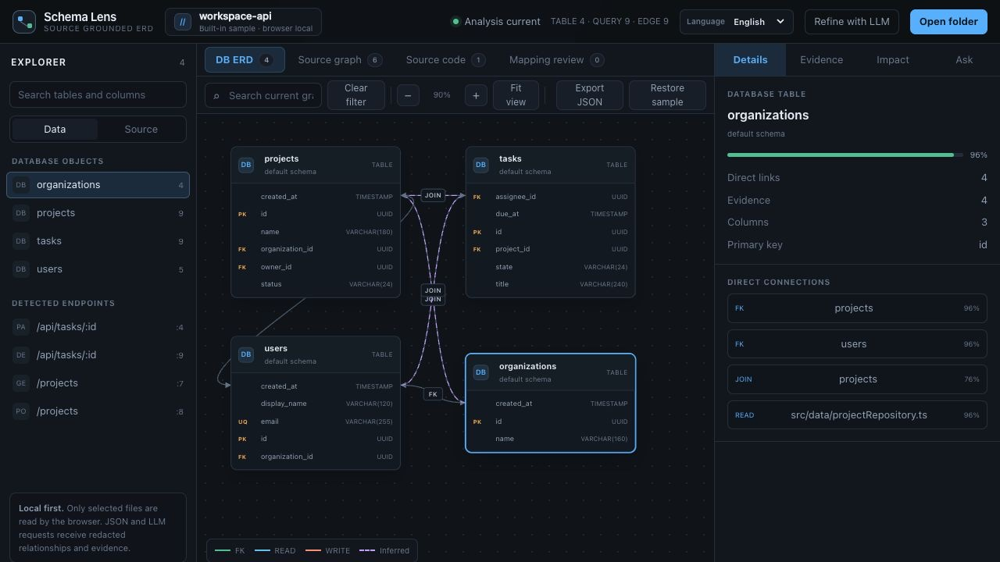
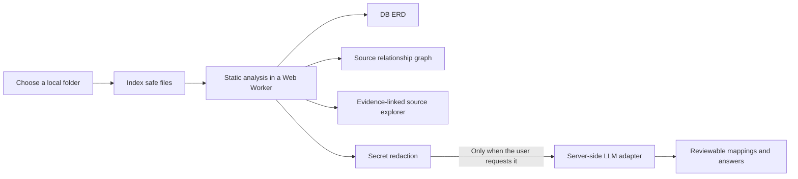
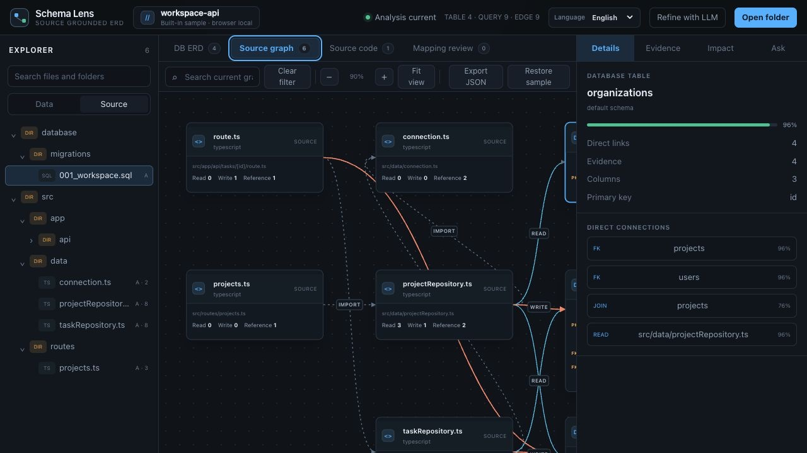
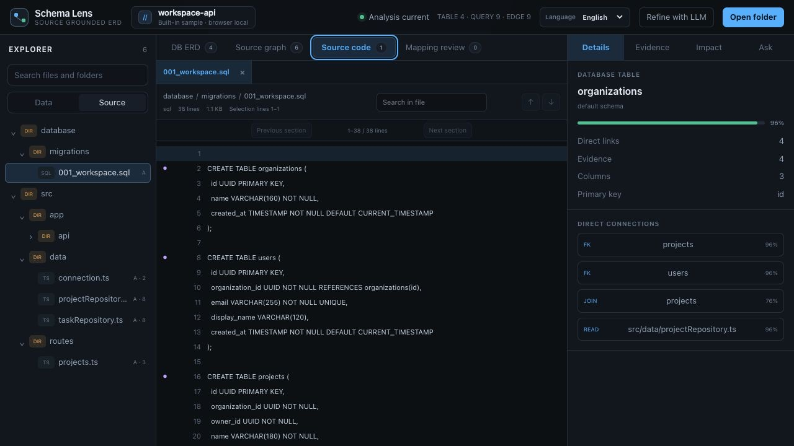

# Schema Lens

[](LICENSE)
[](package.json)

Schema Lens is a source-grounded database ERD, code relationship graph, and read-only source explorer. It reconstructs data structures and execution relationships from local SQL and source code, even when no database connection or current ERD is available.

Choose a local project folder, run static analysis in the browser, and move between graph nodes, relationship evidence, and the exact source lines that created them.



## What it helps you answer

Production systems often have an outdated ERD, no accessible database, or only a source archive. Schema Lens connects the evidence available in that source into one workspace.

| View | What you can inspect |
| --- | --- |
| DB ERD | Tables, columns, PK/FK constraints, inferred joins, and confidence |
| Source graph | File imports, table reads and writes, routes, functions, and layer relationships |
| Source code | Hierarchical file tree, multiple file tabs, in-file search, and highlighted evidence lines |
| Evidence and impact | Relative source paths, line ranges, and change impact up to two hops |
| Mapping review | Optional LLM suggestions for aliases and cross-layer relationships missed by static analysis |
| Natural-language questions | Answers constrained to the current graph and citable evidence, with a local fallback |

LLM suggestions are never merged into the graph automatically. Every proposed relationship remains in a separate review flow until it is accepted or rejected.

## How it works



Folder indexing, source reads, and the first-pass analysis run in browser memory and a dedicated Web Worker. The source workspace lazily reads only selected text files and never modifies the original project.

## Quick start

### Requirements

- Node.js 22.13 or later
- Corepack and pnpm
- A modern desktop browser that supports directory selection

### Install and run

```bash
git clone https://github.com/efficjump/schema-lens.git
cd schema-lens
corepack enable
pnpm install --frozen-lockfile
pnpm dev
```

Open the local URL shown in the terminal. The built-in sample, static analysis, graph explorer, source viewer, and local relationship-based Q&A all work without a database or LLM configuration.

To verify a production build locally:

```bash
pnpm build
pnpm start
```

## Using the workspace

1. **Explore the built-in sample**

   The initial workspace includes tables, queries, routes, and repository-layer source files.

2. **Open a real project**

   Select **Open folder** and choose a project root. The browser provides files directly; Schema Lens displays relative paths and the folder name rather than collecting a workstation-specific absolute path.

3. **Inspect database relationships**

   In **DB ERD**, select a table to review direct links, confidence, columns, constraints, and evidence counts. Search, zoom, and fit controls help navigate larger graphs.

4. **Follow source flow**

   Switch to **Source graph** to trace `IMPORT`, `READ`, and `WRITE` relationships between routes, files, functions, and tables.

   

5. **Open the evidence**

   Use **Open in code** from node details, evidence cards, function or route information, and answer citations. The read-only source workspace opens the exact file and 1-based line range.

   

6. **Ask questions or review mappings**

   Ask about change impact or read/write flow from the **Ask** tab. If no server LLM is configured, Schema Lens uses a local graph-based answer. Proposed precision mappings appear under **Mapping review** with their evidence.

7. **Export the analysis**

   **Export JSON** saves the graph with relative paths and short, redacted evidence excerpts rather than complete source files. Review exported data against your organization’s policy before sharing it.

## Language support

The complete interface is available in English and Korean. On the first visit, Schema Lens follows a Korean browser preference when present and otherwise uses English. The header language control switches the complete workspace explicitly, including:

- explorer labels and accessibility names
- graph controls, legends, and node descriptions
- source viewer controls and evidence actions
- local fallback answers and suggested questions
- analysis, validation, and LLM status messages

The browser stores the selected language locally and updates the document language for assistive technologies. Static-analysis worker and server errors use language-neutral codes or provider-neutral English diagnostics instead of embedding one UI language into the analysis result.

## Optional LLM connection

Static analysis and the local fallback require no configuration. To connect an external LLM, copy the example environment file and set server-only values:

```bash
cp .env.example .env.local
```

```dotenv
LLM_API_URL=https://llm.example.com/v1/responses
LLM_MODEL=your-model-id
LLM_API_KEY=your-server-side-key
LLM_API_STYLE=responses
LLM_RATE_LIMIT_PER_MINUTE=12
```

| Variable | Required | Purpose |
| --- | --- | --- |
| `LLM_API_URL` | For LLM use | HTTPS API URL; localhost HTTP is also accepted during development |
| `LLM_MODEL` | For LLM use | Model identifier understood by the configured API |
| `LLM_API_KEY` | Optional | Server-only bearer credential |
| `LLM_API_STYLE` | Optional | `responses` or `chat-completions`; defaults to `responses` |
| `LLM_RATE_LIMIT_PER_MINUTE` | Optional | Per-runtime-instance guard; `0` disables it and the default is `12` |

Both API styles must support JSON Schema structured output. URL, credential, and model values stay out of the client bundle, and the status endpoint does not disclose the configured provider or model identifier. Use the deployment platform’s secret manager instead of uploading `.env.local`.

## Analysis coverage

The browser analyzer currently recognizes:

- `CREATE TABLE`, `ALTER TABLE`, inline and table-level PK/FK declarations, and composite keys
- `SELECT`, `INSERT`, `UPDATE`, `DELETE`, aliases, and `JOIN`
- tables and columns found only in queries, with confidence-marked inference
- TypeScript/JavaScript, Python, Java, Kotlin, Go, Ruby, PHP, C#, Scala, and Rust
- SQL, Prisma, XML, and YAML-family files
- Express and Next-style routes, Python decorators, and Spring annotation-style routes
- relative imports, functions and methods, and file-level read/write relationships

Static analysis cannot fully recover every dynamically assembled SQL statement, identifier, ORM query builder, or stored-procedure branch. Every node and relationship therefore keeps `high`, `medium`, or `low` confidence together with file and line evidence.

## Resource limits

| Resource | Default limit |
| --- | ---: |
| Indexed source tree | 5,000 files |
| Static-analysis input | 800 files |
| One analysis file | 2 MiB |
| Total analysis input | 32 MiB |
| One source preview | 4 MiB |
| Open source tabs | 12 |
| Source cache | About 12 MiB of characters |
| Rendered code window | 400 lines |

For folders above 5,000 files, bounded priority selection preserves the most useful analyzable text and reports excluded counts. Reads use limited concurrency and cancellation. Switching projects terminates the previous worker and LLM requests, and late results are discarded. The source viewer indexes line offsets rather than duplicating the entire file as an array of strings.

## Privacy and trust boundaries

- `.env`, private keys and certificates, `.git`, dependencies, and build output are excluded from listing and analysis.
- Complete source text is not stored in the graph, JSON export, or persistent browser storage.
- When an LLM feature is explicitly run, the question, recent conversation, relative paths, compact graph, and relevant evidence excerpts pass through the server to the configured external API. Complete files are not sent.
- API keys, bearer tokens, JWTs, database URLs, passwords, and private-key patterns are redacted in both browser and server paths.
- Redaction is a defense layer, not complete DLP. It cannot identify every custom credential, personal record, or trade secret.
- For sensitive repositories, disable LLM features or add organization-specific DLP, access control, audit logging, and distributed rate limiting.
- The retention and training policy of an external API is outside this application’s control and should be reviewed before connection.

## Project structure

```text
app/components/                  Workspace, graph, source tree, source viewer, and localization
app/workers/analyzer.worker.ts   Cancelable static-analysis worker
app/api/llm/                     Mapping, question, and status APIs
lib/analyzer.ts                  SQL/source analysis engine and demo data
lib/source-workspace.ts          Safe paths, source tree, line offsets, and search
lib/llm/provider.ts              Provider-neutral LLM API adapter
lib/llm/redaction.ts             Secret redaction and evidence allowlist
lib/llm/validation.ts            Input/output schemas and evidence cross-checking
tests/                           Analysis, security, worker, rendering, and regression tests
```

## Development and validation

```bash
pnpm lint
pnpm exec tsc --noEmit
pnpm test
```

`pnpm test` creates a production build before running the Node.js test suite. Regression coverage includes SQL and source analysis, CR/LF/CRLF line numbering, worker protocol behavior, bounded file selection, code search and windowing, secret redaction, safe rendered HTML, CSP, and localization-safe output.

## Deployment notes

The current build targets a Workers-style edge runtime. For another environment, connect `worker/index.ts` and the security headers using that platform’s runtime conventions.

Before a public deployment, add:

- server-side secret storage for the LLM credential
- application access policy or user authentication
- platform-level distributed rate limiting and cost controls
- CSP, HTTPS, log redaction, and error-response review
- a separate third-party license bundle for distributed builds or containers

## License

The source is available under the [MIT License](LICENSE). Direct and transitive dependency review notes, including binary redistribution considerations, are in [THIRD_PARTY_NOTICES.md](THIRD_PARTY_NOTICES.md).

After changing dependencies, review the installed SPDX licenses again:

```bash
pnpm licenses list --json
```

## Contributing and security reports

Use a minimal synthetic sample instead of attaching real secrets or proprietary source to a bug report. Report vulnerabilities through the repository’s private security reporting channel rather than a public issue.

See [CONTRIBUTING.md](CONTRIBUTING.md) and [SECURITY.md](SECURITY.md) for the full process.
